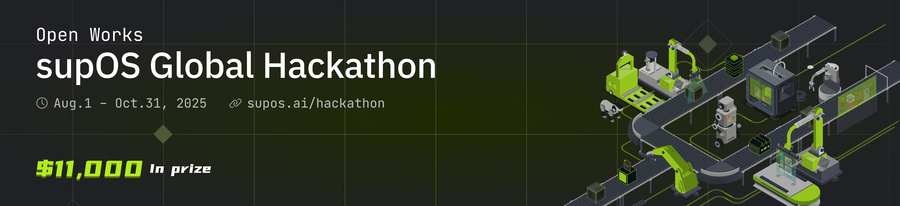

# 🏁 supOS Global Hackathon 2025: Next-Gen Factory Challenge  

**August 1 – October 31, 2025**

Build the future of smart factories with **supOS-CE**, the open-source industrial data platform.

---

## 🎯 What is this?

A 3-month global hackathon to reimagine industrial software. Choose your track:

1. **supOS+** – Build new apps with supOS  
2. **supOS Pro** – Improve or extend the platform  
3. **Real-World Deployment** – Apply supOS in real or simulated factory environments  

👉 [Full details here](https://supos.ai/hackathon)

---

## 📅 Timeline

| Phase | Date |
|-------|------|
| Starts | August 1, 2025 |
| Ends | October 31, 2025 |

---

## 🧠 Resources

- [supOS-CE on GitHub](https://github.com/FREEZONEX/supOS-CE)  
- [Documentation](https://suposcommunity.vercel.app)  
- [Get Started](https://supos.ai/trial)  
- [Join Discord](https://discord.gg/K92gcRWabU)

---

## 👥 Team Up

Looking for teammates?  
Introduce yourself in `#team-up-hub` on [Discord](https://discord.gg/K92gcRWabU) and start building!

---

## 🏆 Prizes

Over **$11,000 USD** in prizes for top projects — plus swag, community awards, and global recognition.

---

Let’s build the next-gen factory together 💪
